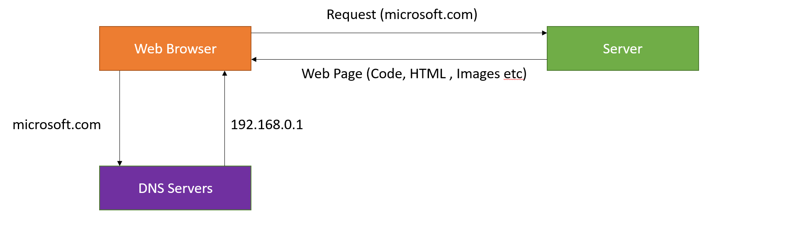

# Challenge 2 - Publish ContosoMasks website

[< Previous Challenge [1]](./Challenge01.md) - **[Home](../README.md)** - [Next Challenge [3] >](./Challenge03.md)

## Pre-requisites

- Azure subscription
- Your own GitHub repo with the source code of ContosoMasks

## Introduction

When it comes to publishing a website to the Internet, we need to keep in mind a few basics: 
Web Browsers (Microsoft Edge, Google Chrome, Mozilla Firefox etc) are the general clients used to interact with Web Sites. For a Web Browser to load a web site, generally you need the following:
- A Domain Name 
  - This lets your Web Browser take ***www.contosomasks.com*** and turn that into an IP Address to then talk to.
- Something to host your content/website
  - There are lots of choices to run the application code and/or store the JavaScript, CSS, and HTML files.

How Web Works:

  

## Ok, we need domain name and some kind of server to host the website source code... but where сan we find them?

Fortunately, Azure has a solution for all of the above!

**Azure App Service** is a fully managed platform as a service (PaaS) designed for hosting web sites, web applications, REST API and many other things. 

Key features of Azure App Service:
- Supports multiple languages and frameworks - ASP.NET, ASP.NET Core, Java, Ruby, Node.js, PHP, Python and PowerShell.
- Integrates with Azure DevOps, GitHub, BitBucket, Docker Hub, or Azure Container Registry.
- Autoscalable out of the box
- Can be injected to Virtual Networks  

and dozens of others!

Ok, we've decided where to host the website. But how to get the code to App Service?

There are several options: deploy via FTP, use some IDE plugins, but the most modern way is to use **Continious Deployment** - software engineering approach in which software is delivered through automated deployments. Modern cloud services (such as Azure App Service) provides **out-of-the box functionality** to configure autodeployment of your source code to the App Service instance! 

## Description

For this challenge we are going to:
- Deploy the App Service instance
- Publish the source code to App Service by setting up GitHub integration
- Check out your freshly deployed website

## Success Criteria

- Show the newly deployed resources in the Azure Portal
- Demonstrate that your website is up and running

 <!--
## Bonus task , if time permits
- Modify the source code to change the heading from "Contoso Masks" to something new and make sure it is updated on your website.
-->

## Learning Resources

- [How to create Azure App Service](https://www.cyberithub.com/how-to-create-app-services-in-azure-portal-step-by-step-guide)
- [Continious Deployment in App Service](https://docs.microsoft.com/en-us/azure/app-service/deploy-continuous-deployment?tabs=github)

