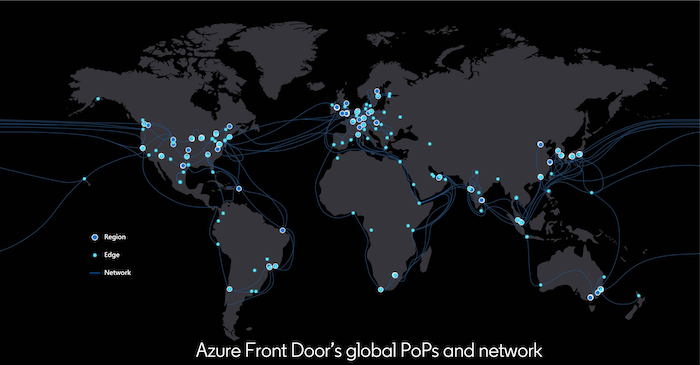

# Challenge 3 - Move ContosoMasks closer to customers

[< Previous Challenge [2]](./Challenge02.md)&nbsp;&nbsp;-&nbsp;&nbsp;**[Home](../README.md)**&nbsp;&nbsp;-&nbsp;&nbsp;[Next Challenge [4] >](./Challenge04.md)

## Introduction

Now that we have the site up and running, it's time to start addressing the situation.  Contoso Masks website has started to trend and LOTS of people are hitting the website from all over the world.  Users are complaining about either taking a really long time to load the website or not able to load at all.

For the purpose of this description, lets pretend Contoso Masks' website is hosted in the Central US Azure Data Center only, somewhere the State of Iowa.  If a user is accessing the website in the middle of the United States, most likely has a descent experience.  But what happens when the website is accessed from Germany? 

When talking about the performance characteristic of a single resource request, there are 6 numbers that used to describe it:
1. **DNS Lookup** - This is the time it takes the browser to perform a DNS lookup, or translating www.contosomasks.com to an IP Address.
2. **Connect** - How long does it take for the Web Browser to establish a connection to "server" for the request.  Server is the external ***thing*** that is responding to the request.   *HINT* - This isn't always your webserver.
3. **TLS Handshake** - How long does it take your Web Browser to safely establish a secure tunnel to the server. 
4. **Send Request** - Time to transmit the HTTP Request.
5. **Wait for Response** - Time for the First Byte of the response to be received. (Sometimes referred to as Time to First Byte [TTFB])
6. **Receive Response** - Time for full payload to receive (Sometimes referred to as Time to Last Byte [TTLB])

#### Things you control with optimizing code of your website:
- #5 is basically what your web application is processing + transit time for the first byte of response.

#### Where Front Door helps

Since Microsoft is the [2nd largest Telecommunications company](https://docs.microsoft.com/en-us/azure/networking/microsoft-global-network) by measure of the amount of [Dark Fibre](https://en.wikipedia.org/wiki/Dark_fibre) run around the planet, you can use this as your accelerated pathway to your website.

Azure Front Door is Microsoft’s modern cloud Content Delivery Network (CDN) that provides fast, reliable, and secure access between your users and your applications’ static and dynamic web content across the globe. Globally, Front Door has over 150 edge locations, or points of presence (PoPs), located in many countries and regions. Every Front Door PoP can serve traffic for any request.

  

There are 2 primary benefits: 
1. By moving the *"Server"* closest to the user (the Point of Presence), the per user Connect (#1) and TLS Handshake (#2) happens closest to the user. 
2. For global (and regional performance), taking advantage of the private pathing thru Microsoft's network provides a way to predictably accelerate requests to and from your website.  Public internet routing is reliable from the aspect of getting your requests back and forth, but unpredictable from a performance perspective.

## Description

For this challenge we are going to:
- Provision Azure Front Door resource and configure it to route requests to your website

## Success Criteria

- Demonstrate the website working thru Front Door endpoint
- With 2 Browser windows open to [https://tools.medianova.com/](https://tools.medianova.com/), test the performance of AppService (XXX.azurewebsites.net) and FrontDoor (XXX.azurefd.net) endpoints of your website. Make sure to run it 3 times prior looking at a final result. Compare the Connect and TLS times. What has changed? Explain to your coach

## What is out of scope in this challenge
- There is no need to implement Caching at the time.
- We aren't focusing on regional data compliance issues (GDPR for example). 

## Learning Resources

- [Azure Front Door](https://docs.microsoft.com/en-us/azure/frontdoor/front-door-overview)
- [Quickstart: Create an Azure Front Door service using Azure Portal](https://docs.microsoft.com/en-us/azure/frontdoor/quickstart-create-front-door)
- [Azure Front Door Edge locations ](https://docs.microsoft.com/en-us/azure/frontdoor/edge-locations-by-region)

