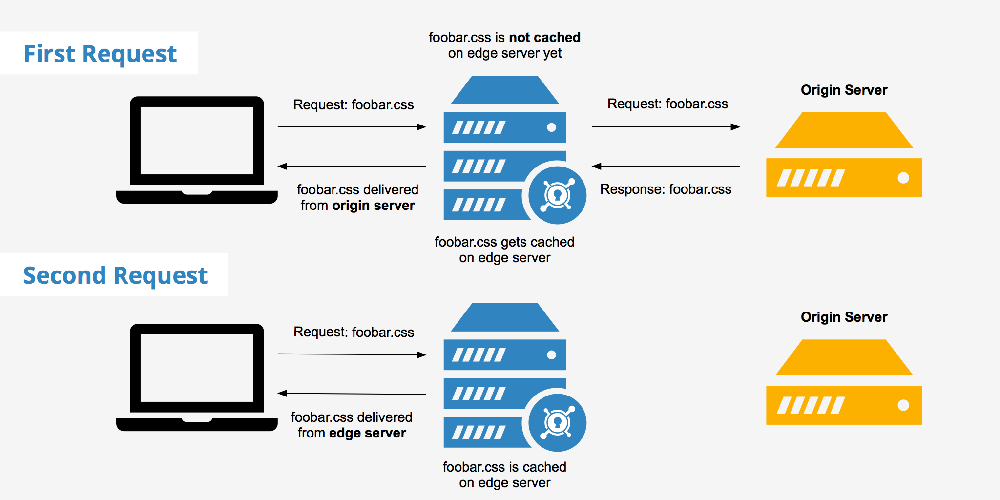

# Challenge 4 - Speed up the website

[< Previous Challenge [3]](./Challenge03.md)&nbsp;&nbsp;-&nbsp;&nbsp;**[Home](../README.md)**&nbsp;&nbsp;-&nbsp;&nbsp;[Next Challenge [5] >](./Challenge05.md)

## Introduction

Things are going well.  The website is able to handle global traffic well  What else can we do?

Azure Front Door routes clients' requests to our server (origin), then server processes the requests and returns a response. In case of thousands or millions requests per second server may be overloaded, so that can lead to performance issues or/and high cost if we enable autoscaling. 

**Caching** is the concept of storing a response from your website for a configured period of time. It can greatly increase the end client performance and website utilizations. As you may remember, Azure Front Door is a CDN, or content delivery network service can cache content at **Points of Presence** that are located closer to end users than origin servers. When caching is enabled, Azure Front Door doesn't route requests to the origin if the requested content has already been cached.

  

## Description

For this challenge we are going to: 
- Configure Front Door to enable caching

## Success Criteria

1. Demonstrate that you have caching enabled.
2. Compare the page loading time between Azure App Service and Front Door endpoints. Is there any difference? Explain to your coach
   - Use https://gtmetrix.com to compare loading time. Run test for one endpoint, then click "compare" and paste the second endpoint.
4. Simulate 10-20 requests per team member and show cache hit ratio to your coach. What does cache hit ratio mean?

## Learning Resources

- [What is Caching?](https://www.cloudflare.com/learning/cdn/what-is-caching/)
- [How does CDN work?](https://www.cloudflare.com/learning/cdn/what-is-a-cdn/)

