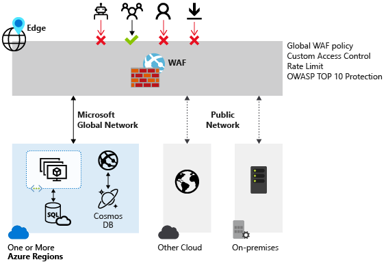

# Challenge 5 - My life - my rules

[< Previous Challenge [4]](./Challenge04.md)&nbsp;&nbsp;-&nbsp;&nbsp;**[Home](../README.md)**

## Introduction

User experience is dramatically better, you are seeing orders from all over the world come in. Your done right?  Nope, we remember now that the Internet can be a scary place...  

Your cybersecurity team has informed you that you are receiving huge amount of malicious traffic from one specific country. Your team was asked to **test how Azure Front Door can help to block such traffic**. This is where a Web Application Firewall (WAF) comes into play.

### What is Web Application Firewall

Web Application Firewall (Layer 7) is a physical or virtual network appliance that defends your web applications from common exploits and vulnerabilities. For Azure this means using a Web Application Firewall Policy with Front Door. The WAF Policies for Azure support Custom Rules sets to allow or deny requests by Client IP(s), payload, or by Geographic area. WAF Policies also have Rule Sets you can apply, one referred to as the "Default Rule Set", are a set of rules defined by OWASP (Open Web Application Security Project). These rules individually targeted various forms of web attack and exploit strategies.

  

### WAF policy can be configured to run in the following two modes:

**Detection mode**: When run in detection mode, WAF doesn't take any other actions other than monitors and logs the request and its matched WAF rule to WAF logs. You can turn on logging diagnostics for Front Door. When you use the portal, go to the Diagnostics section.

**Prevention mode**: In prevention mode, WAF takes the specified action if a request matches a rule. If a match is found, no further rules with lower priority are evaluated. Any matched requests are also logged in the WAF logs.

For the purpose of this challenge, we recommend you to use **Prevention** mode for demonstration purposes. 

## Description

For this challenge we are going to:
- Configure Front Door to allow requests only from the specific country.  ***HINT*** ***There is no documentation explaining how to configure this using Azure Portal, but it is possible***

## Success Criteria

- Demonstrate that requests coming from countries other than your own are being blocked.

## Learning Resources

- [Azure Front Door WAF](https://docs.microsoft.com/en-us/azure/web-application-firewall/afds/afds-overview)
